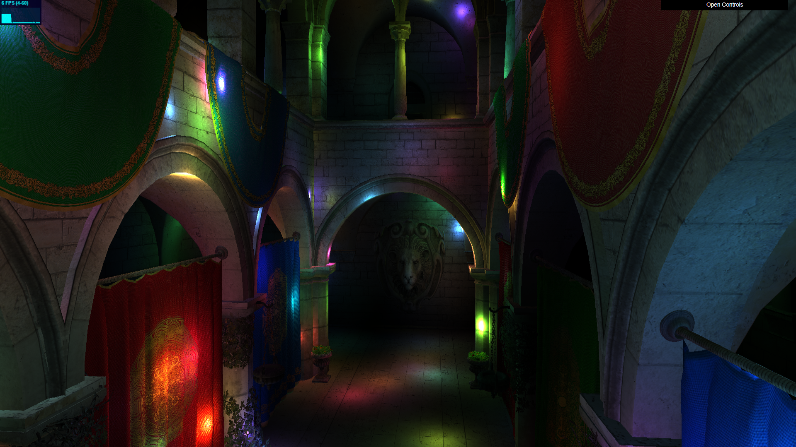
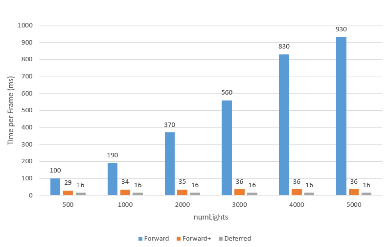

WebGL Forward+ and Clustered Deferred Shading
======================

**University of Pennsylvania, CIS 565: GPU Programming and Architecture, Project 4**

* Zhuoran Li
* Tested on: **Google Chrome 222.2** on
  Windows 11, AMD Ryzen 5 5600H @ 3.30 GHz 16.0GB, NVIDIA GeForce RTX 3050 Laptop GPU 4GB

### Live Demo

[Demo Link](https://github.com/luoluobuli.github.io/CIS565-Project4-WebGPU-Forward-Plus-and-Clustered-Deferred)

### Demo Video/GIF

### Overview
This project includes three rendering methods: **Naive(Foward)**, **Forward+**, and **Clustered Deferred** shading. **Naive** shading is the most straightfoward one, where every light affects every pixel. **Forward+** shading accelerates it by dividing the view into small 3D clusters so that each pixel only uses the lights in its own cluster. **Clustered Deferred** shading goes a step further by first saving surface information like color and normal into textures, then using those to apply lighting in a second pass. 

### Features

#### Forward+
Forward+ renderer improves lighting efficiency by dividing the view frustum into a 3D grid of clusters. The screen is first divided into tiles, which are then sliced by depth using logarithmic spacing. Each cluster keeps track of which lights influence it, allowing each fragment to only compute lighting from relevant lights instead of all lights in the scene. This reduces redundant calculations and improves rendering performance compared to the naive approach.

Further optimization could be achieved by using global atomics to manage shared light indices across clusters, rather than maintaining separate long light lists per cluster. This would reduce memory overhead and improve parallel efficiency, especially in scenes with many lights and overlapping clusters.

#### Clustered Deferred
The Clustered Deferred renderer extends the Forward+ approach by separating rendering into two distinct passes. In the first pass, geometric information including position, normal, and color is stored into G-buffers. In the second pass, lighting is computed using the data from these buffers along with the clustered light information. This decoupled process avoids performing complex lighting calculations during the geometry pass, allowing for efficient rendering of scenes with a large number of lights and objects.

### Performance Analysis

As the data shows, Forward rendering scales very poorly with light count: the frame time rises sharply from 100 ms at 500 lights to 930 ms at 5000 lights. 

In contrast, Forward+ maintains near-constant performance (about 29–36 ms) even as lights increase from 500 to 5000. By clustering lights into screen-space tiles and only shading with the relevant subset per pixel, it drastically reduces redundant light calculations. 

Finally, Deferred rendering stays completely constant at ~16 ms regardless of light count, since its lighting computations are decoupled from scene geometry and use screen-space G-buffer data, making it highly efficient for large numbers of lights.

### Credits

- [Vite](https://vitejs.dev/)
- [loaders.gl](https://loaders.gl/)
- [dat.GUI](https://github.com/dataarts/dat.gui)
- [stats.js](https://github.com/mrdoob/stats.js)
- [wgpu-matrix](https://github.com/greggman/wgpu-matrix)
